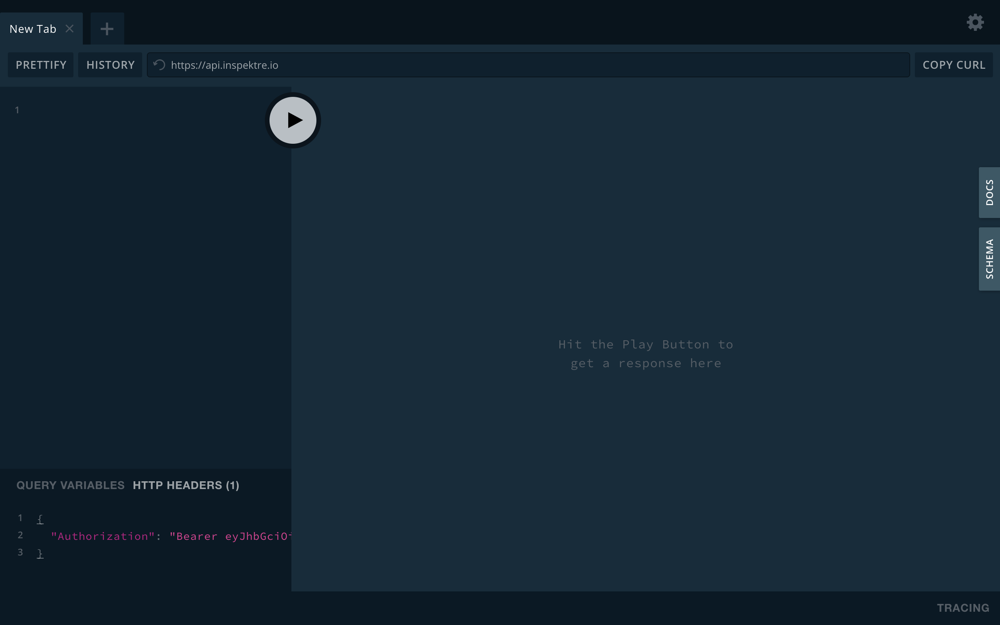

import { Link } from 'gatsby';

# API Authorization

API Authorization with GraphQL Playground can be accomplished by setting authorization header. The bearer token can be generated in two ways.

# Bearer Token - Options to generate:
1. ``` Temporary Access ``` Copy user's current session token from the Dashboard.
2. ``` Device Authorization Flow ```Use Inspektre CLI/SDK to regenerate tokens easily.


## Temporary Access
1. Visit https://app.inspektre.io/#/profile/user and click on the button `Authorization Token` to copy token to clipboard.
2. Paste the token under the `HTTP Headers` in GraphQL Playground.
3. Check the screenshot below for look & feel.

## Device Authorization Flow
1. Install Inspektre SDK/CLI<Link to="https://docs.inspektre.io/gettingstarted/2-installation"> (Instructions)</Link>
2. Set required environment variables <Link to="https://docs.inspektre.io/gettingstarted/4-environment"></Link>
3. Type `inspektre authorize` to initiate device authorization flow.
4. Locate Bearer Token from the user directory:
    - Micosoft Windows: `C:\Users\<user>\.config\inspektre\.env`
    - Mac OS X: `/Users/<user>/.config/inspektre/.env`
    - ChromeOS & Linux (Debian/Fedora/): `/home/<user>/.config/inspektre/.env`
5. Copy the the token and Paste the token under the `HTTP Headers` in GraphQL Playground.
6. Check the screenshot below for look & feel.


# Screenshot
