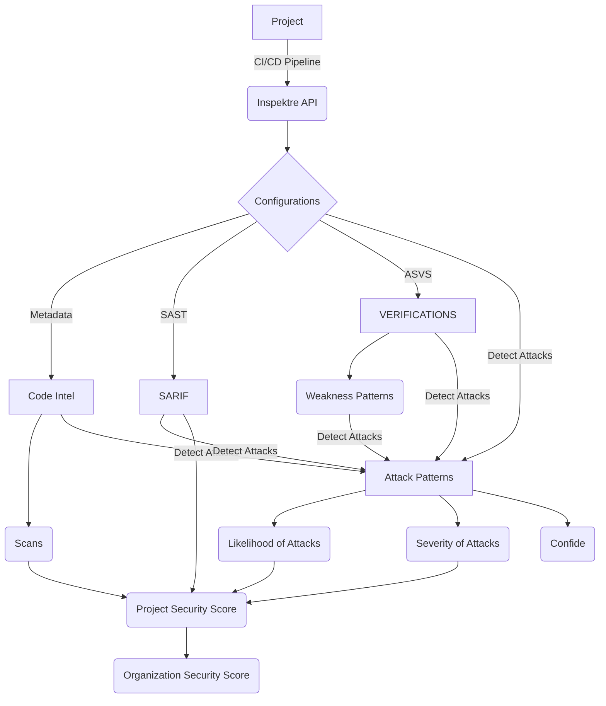
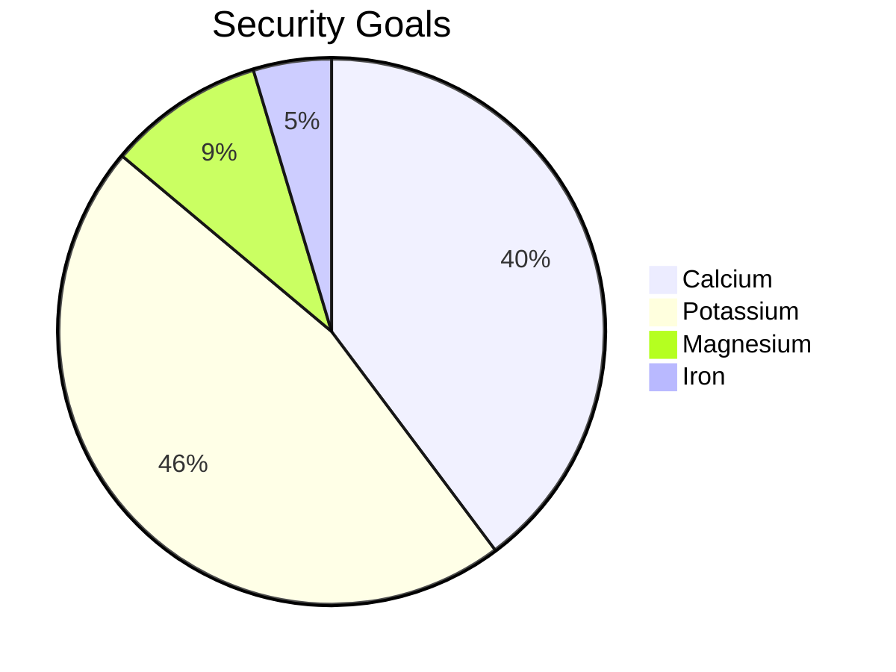

# Project
Project(s) on-boarded on inspektre are enhanced to create meaningful knowledge-graphs and help providing contextually relevant information. Below graph shows a quick high-level view on how inspektre graphs look like.

# Structure
Below is a representative structure of how a project is analysed to produce security score.

