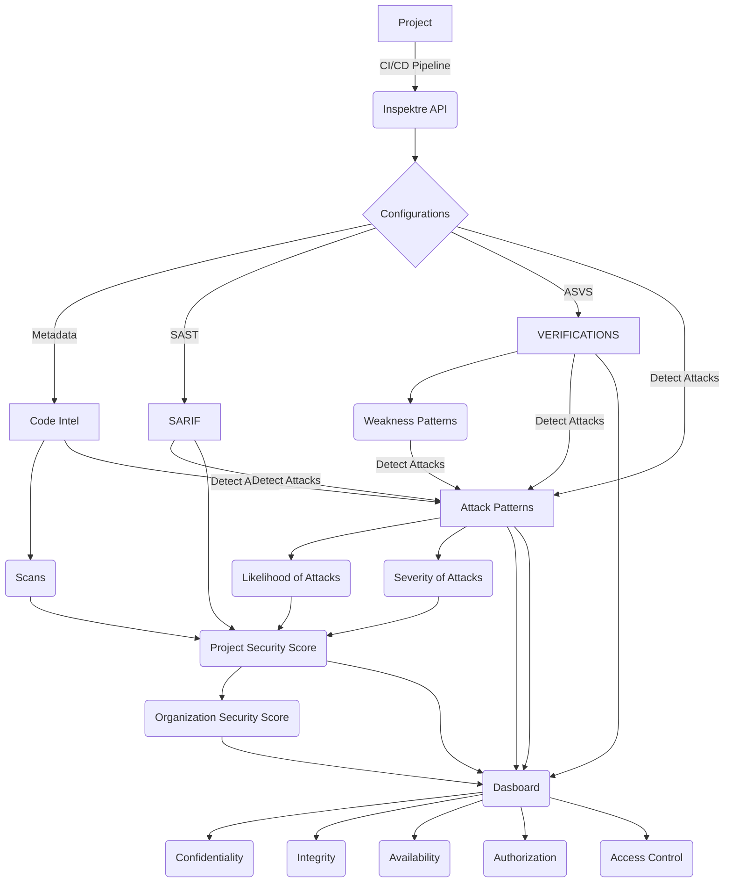

# Project
Project(s) on-boarded on inspektre are enhanced to create meaningful knowledge-graphs and help providing contextually relevant information. Below graph shows a quick high-level view on how inspektre graphs look like.

# Structure
Below is an end-to-end data-flow of data from CI/CD to what is visible on a dashboard.

Further, 
